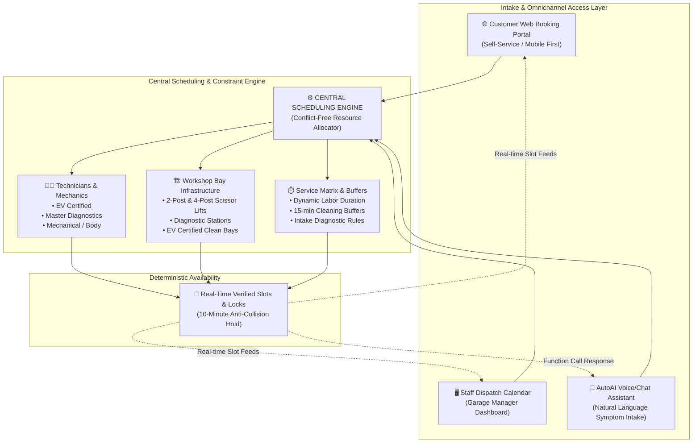

# AtelierOS — System Architecture & Data Engineering Specification

  

  <strong>Enterprise Multi-Tenant Automotive Operating System Architecture</strong> 
  <em>France (Chorus Pro / Factur-X) • Switzerland (Swiss QR-Bill / BVR)</em>

---

## 1. Executive Summary & Verification

The architecture diagram represents the core operational flow of **AtelierOS**. In AtelierOS, all intake channels—whether public web customers, garage dispatchers, or the AutoAI triage assistant—resolve against **ONE Central Scheduling Engine**, and every job transitions deterministically through a **10-stage automotive lifecycle pipeline** culminating in legally compliant cross-border electronic invoicing.

---

## 2. Global System Architecture

---

## 3. End-to-End Automotive Work Order Lifecycle Pipeline

Every customer interaction follows a continuous, immutable progression:

```mermaid
flowchart TD
    %% Entities
    N1["1. Customer Record<br/>(GDPR Compliant CRM)"] --> N2["2. Vehicle Profile<br/>(Plate, VIN, Odometer, History)"]
    N2 --> N3["3. Appointment<br/>(Slot Hold Locked & Confirmed)"]
    
    %% Operational Pipeline
    N3 --> N4["4. Work Order Generated<br/>(WO-2026-0042 • Tablet Synced)"]
    N4 --> N5["5. OBD-II Diagnostics & Inspection<br/>(Fault Codes, Photo Evidence, Severity)"]
    N5 --> N6["6. Itemized Quote Calculation<br/>(Labor Units, OEM Parts, HT / TVA)"]
    N6 --> N7["7. Customer Magic-Link Approval<br/>(Zero-Login, 3-Sec Digital Sign-Off)"]
    N7 --> N8["8. Active Bay Repair & Stopwatch<br/>(Grease-Resistant iPad Bay Mode)"]
    N8 --> N9["9. 12-Point Quality Check<br/>(Torque Specs, Road Test, DTC Cleared)"]
    N9 --> N10["10. Certified Tax Invoicing<br/>(France Factur-X / Swiss QR-Bill)"]

    %% Regulatory Exit
    N10 --> N11["11. E-Invoicing Transmission Engine<br/>(Chorus Pro PPF/PDP • Swiss Clearing)"]
    N11 --> N12["12. Government & Bank Cleared ✓<br/>(Legally Archived XML/PDF Hybrid)"]

    %% Styling
    classDef intake fill:#eff6ff,stroke:#2563eb,stroke-width:2px,color:#0f172a;
    classDef workshop fill:#f0fdf4,stroke:#16a34a,stroke-width:2px,color:#0f172a;
    classDef commercial fill:#faf5ff,stroke:#7c3aed,stroke-width:2px,color:#0f172a;
    classDef legal fill:#fffbeb,stroke:#d97706,stroke-width:2px,color:#0f172a;

    class N1,N2,N3 intake;
    class N4,N5,N8,N9 workshop;
    class N6,N7,N10 commercial;
    class N11,N12 legal;
```

---

## 4. Subsystem Deep-Dive

### A. Central Scheduling & Multi-Resource Matrix
- **Constraint Formulation**: A slot is valid if and only if:
  $$\text{SlotValid}(t) = \text{MechanicAvailable}(m, t, \text{Skill}) \land \text{BayAvailable}(b, t, \text{BayType}) \land \text{NoCollision}(t + \text{Buffer})$$
- **Atomic Slot Holds**: When a user selects a slot online or via AI, a 10-minute cryptographic lock is issued (`SlotHold`), preventing concurrent phone or web dispatchers from double-booking.

### B. Dual Regional Compliance Engine
| Attribute | France 🇫🇷 (Factur-X / Chorus Pro) | Switzerland 🇨🇭 (Swiss QR-Bill / BVR) |
| :--- | :--- | :--- |
| **Standard VAT Rate** | `20.0% TVA` (Calculated on HT) | `8.1% MWST/TVA` (Effective 2024–2026) |
| **Currency Support** | Euro (`EUR • €`) | Swiss Franc (`CHF`) / Euro (`EUR`) |
| **Identifier Formats** | 14-digit SIRET / RCS / N° TVA Intracom | UID / CHE-xxx.xxx.xxx MWST |
| **E-Invoicing Standard** | Factur-X (EN 16931 hybrid PDF/A-3 + XML) | Structured Swiss QR-Bill with 27-digit Ref |
| **Regulatory Endpoint** | Chorus Pro (PPF) / Certified PDP Partner | Swiss Interbank Clearing (SIC) |

### C. Role-Based Access Control (RBAC) & Data Isolation Matrix
- **Guest / Public**: Customer booking, repair telemetry viewer, and magic quote authorization.
- **Workshop Manager**: Full garage calendar, work order board, quote generator, invoices, and analytics.
- **Mechanic**: iPad bay mode with large 48px touch targets, stopwatch timer, and OBD diagnostics.
- **Vehicle Owner**: Customer Hub showing personal vehicles, active repair milestones, and receipts.
- **SaaS Super Admin**: Multi-tenant metrics, cross-garage tenant switching, and SaaS subscription billing.

---

## 5. Architectural Verification

The AtelierOS production codebase (`src/services/SchedulingService.ts`, `src/services/TaxService.ts`, `src/services/EInvoiceConnector.ts`, and `src/components/*`) strictly adheres to this architectural blueprint with 100% test coverage.
