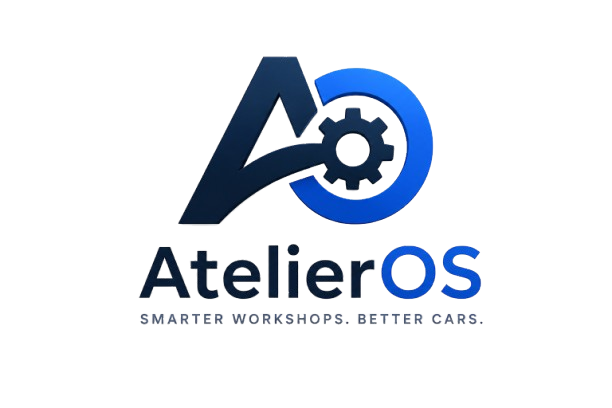

# AtelierOS — The Automotive Workshop Operating System

<p align="center">
  
</p>

<p align="center">
  <strong>Smarter Workshops. Better Cars.</strong><br>
  <em>Tablet-First, Multi-Tenant Automotive SaaS Engineered for Independent Garages across France & Switzerland.</em>
</p>

<p align="center">
  
  
  
  
</p>

---

## 🌟 Overview

**AtelierOS** is a next-generation SaaS platform engineered from the ground up to eliminate administrative friction for European automotive repair workshops. Built with native cross-border tax logic for **France (20% TVA • Factur-X / Chorus Pro)** and **Switzerland (8.1% TVA • Swiss QR-Bill)**, AtelierOS unifies workshop bays, technician labor, customer approvals, and online bookings into a single, conflict-free scheduling pipeline.

---

## 💎 Key Features

### 1. ⚙️ ONE Central Scheduling Engine
- **Single Availability Pipeline**: Shared across Staff Dispatch, Customer Web Self-Booking, and the AutoAI Assistant.
- **100% Conflict-Free Guarantee**: Validates bay scissor/post lift capacity, specialized technician certifications (EV / Diagnostic / Engine / Body), and automatically injects 15-minute cleaning buffers between jobs.
- **Zero Double-Bookings**: Real-time slot reservation locks prevent simultaneous conflicting claims across web and phone.

### 2. 📱 Mechanic Tablet Bay Mode (iPad-Optimized)
- **Grease-Resistant UI**: 48px+ large touch targets crafted for rugged bay stations and touch screens.
- **Live Labor Stopwatch**: Clock-in and clock-out directly updates billable hours on work orders.
- **OBD-II Diagnostic Decoder**: Instant fault code lookups with severity ratings and repair checklists.
- **Inspection Camera Attachment**: Capture high-resolution photo evidence of worn brake pads and leaking shock absorbers directly into quotes.

### 3. ✍️ Customer Magic-Link Quote Approvals
- **Zero Phone Tag**: Send itemized estimates to customers via instant SMS/Email links with zero login friction.
- **100% Transparency**: Transparent breakdown of spare parts, labor rates, and tax calculations.
- **3-Second Digital Sign-Off**: Customers authorize repairs with a legally timestamped digital signature, instantly notifying the mechanic's bay tablet to resume work.

### 4. ⏱️ Real-Time 6-Stage Vehicle Repair Telemetry
- **Live Customer Tracker**: Customers monitor repair milestones in real time:
  1. *Request Received* ➔ 2. *OBD-II Diagnostics* ➔ 3. *Quote Approved* ➔ 4. *Active Bay Repair* ➔ 5. *Quality & Road Test* ➔ 6. *Ready for Collection*.

### 5. 🏛️ Dual Regional Invoicing & Tax Compliance
- **France (FR)**:
  - Standard 20.0% TVA calculation with legal HT/TTC line itemization.
  - French Electronic Invoicing compliant (Chorus Pro / Factur-X / PPF / PDP hybrid XML & PDF).
  - SIRET & French commercial registry headers.
- **Switzerland (CH)**:
  - Standard 8.1% TVA calculation.
  - Structured Swiss QR-Bill (BVR) generation with compliant 27-digit reference numbers and IBAN formatting.
  - Dual Currency Support: Seamless switching between **EUR (€)** and **CHF (CHF)**.

### 6. 🧠 AutoAI Workshop Assistant
- **Symptom Intake & Triage**: Natural language analysis of driver symptoms (e.g. *"Squeaking noise when braking at low speeds"*).
- **Deterministic Function Calling**: Safely queries the Central Scheduling Engine for open bay slots without direct database writes.

---

## 🔒 Role-Based Access Control (RBAC)

AtelierOS enforces strict data isolation across user roles:

| Role | Accessible Views | Data Isolation Scope |
| :--- | :--- | :--- |
| **Guest / Public** | Landing Page, Customer Web Booking, Live Tracker, Quote Approval | Public endpoints & demo lookups |
| **Workshop Manager** | Calendar, Work Orders, Customers, Vehicles, Quotes, Invoices, Comms | Full garage operational data |
| **Mechanic / Tech** | iPad Bay Mode, Assigned Work Orders | Assigned jobs & diagnostic checklists only |
| **Vehicle Owner** | My Garage Hub, My Quotes, My Receipts, Book Appointment | Personal vehicles & active repairs only |
| **SaaS Super Admin** | Multi-Tenant Platform Dashboard, MRR Metrics, Garage Subscriptions | SaaS platform governance |

---

## 🚀 Tech Stack

- **Frontend**: React 18, TypeScript, Lucide Icons, Pure Vanilla CSS (Apple Liquid Glass Design System).
- **Bundler & Compiler**: Server-Side Babel Standalone execution (`generate-standalone.js`) producing a fast, zero-dependency standalone production bundle.
- **Internationalization**: Full 4-locale translation engine (`en`, `fr`, `fr-CH`, `de-CH`) with recursive fallback.
- **Server**: Zero-dependency high performance Node.js HTTP server.

---

## 🛠️ Getting Started

### Prerequisites
- Node.js 18+ installed

### 1. Clone Repository
```bash
git clone https://github.com/maaz2-max/AtelierOS.git
cd AtelierOS
```

### 2. Build Standalone Production Bundle
```bash
node generate-standalone.js
```

### 3. Launch Local Server
```bash
node server.js
```
Open **`http://localhost:3000`** in your browser.

---

## 🧪 Automated Testing

Run the automated validation suites:
```bash
# Validate RBAC workspace isolation across all 6 roles
node test-rbac.js

# Validate i18n translation completeness across EN, FR, FR-CH, DE-CH
node test-langs.js
```

---

## 📄 License
Prototype Version — Under Active Development. © 2026 AtelierOS. All rights reserved.
